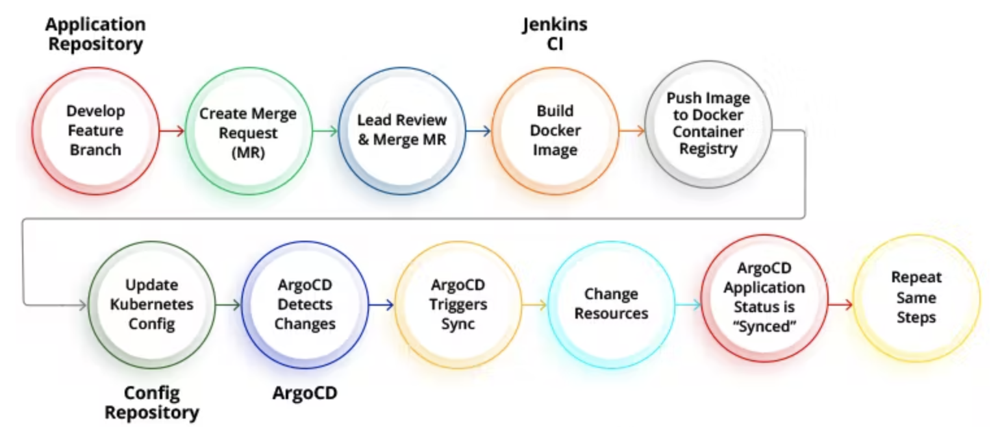
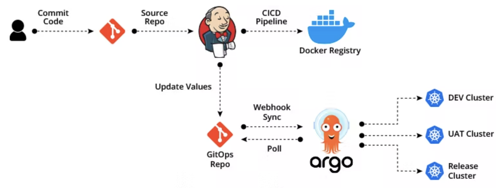

# What Is Argo CD?
`Argo CD` is a Kubernetes-native `continuous deployment (CD)` tool. Unlike external CD tools that only enable push-based deployments, `Argo CD` can pull updated code from Git repositories and deploy it directly to Kubernetes resources.

# GitOps with Argo CD
`GitOps` is a software engineering practice that uses a Git repository as its single **source of truth**. 

A basic part of the `GitOps` process is a pull request. New versions of a configuration are introduced via pull request, merged with the main branch in the Git repository, and then the new version is automatically deployed. The Git repository contains a full record of all changes, including all details of the environment at every stage of the process.

# At a high level, the Argo CD process works like this:

- A developer makes changes to an application, pushing a new version of Kubernetes resource definitions to a Git repo.
- Continuous integration is triggered, resulting in a new container image saved to a registry. 
- A developer issues a pull request, changing Kubernetes manifests, which are created either manually or automatically.
- The pull request is reviewed and changes are merged to the main branch. This triggers a webhook which tells Argo CD a change was made.
- Argo CD clones the repo and compares the application state with the current state of the Kubernetes cluster. It applies the required changes to cluster configuration.
- Kubernetes uses its controllers to reconcile the changes required to cluster resources, until it achieves the desired configuration.
- Argo CD monitors progress and when the Kubernetes cluster is ready, reports that the application is in sync.
- ArgoCD also works in the other direction, monitoring changes in the Kubernetes cluster and discarding them if they don’t match the current configuration in Git.

